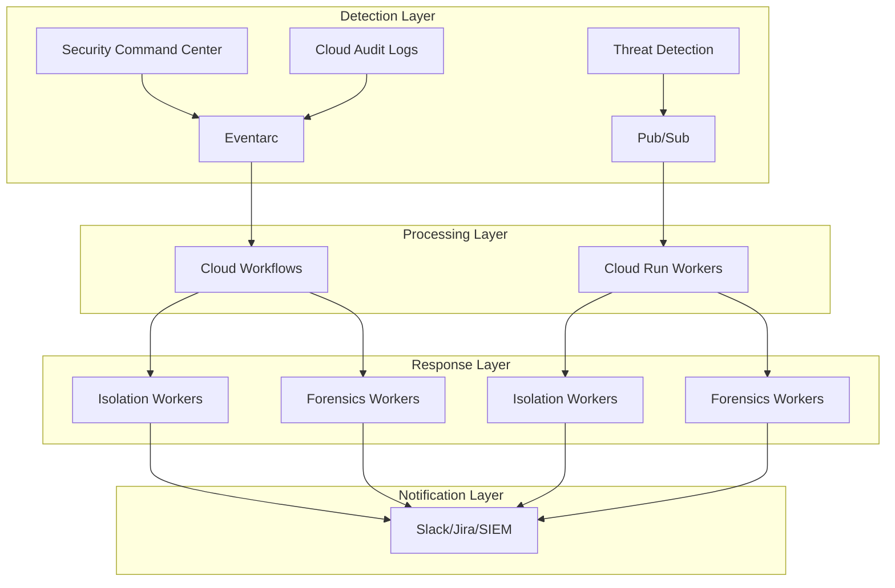
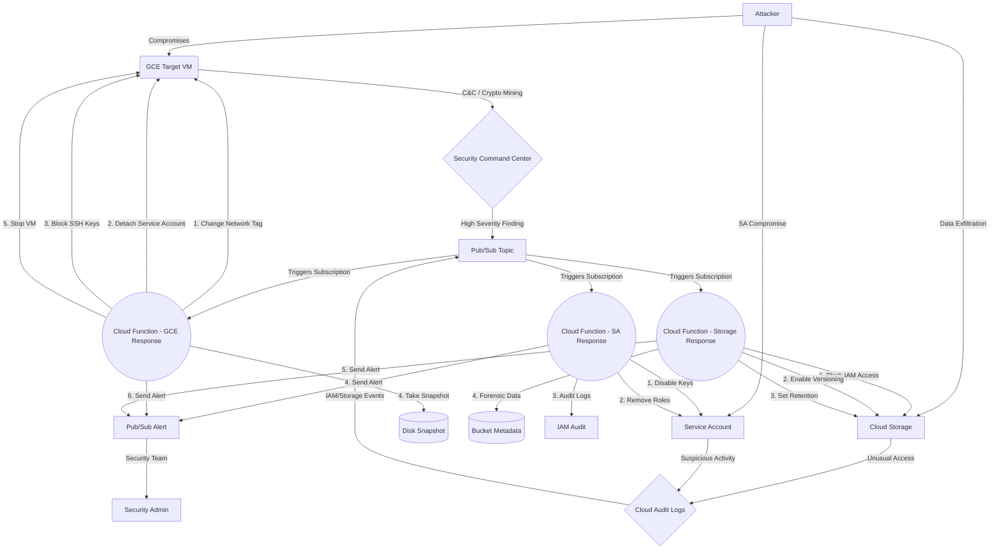

# 🚀 GCP Serverless Security Orchestration, Automation, and Response (SOAR)

 
 


Automated security incident response platform that detects threats using Security Command Center and automatically isolates compromised resources while preserving forensic evidence.

## 🏗️ Architecture Overview

### System Architecture
```
Threat Detection → Event Router → Message Queue → Workflow Engine → Workers
     ↓                    ↓              ↓              ↓           ↓
GuardDuty/SCC → EventBridge/Eventarc → SQS/PubSub → Step Functions/Cloud Workflows → Container Workers
```

### GCP Architecture Flow


### Workflow Process
1. **Detection:** SCC detects threats (severity >= 7.0)
2. **Event Routing:** Eventarc routes to Pub/Sub queue
3. **Workflow Engine:** Cloud Workflows orchestrates response
4. **Container Workers:** Cloud Run performs long-running operations
5. **Human Approval:** Manual approval for critical actions
6. **Integrations:** Slack, Jira, SIEM notifications

## �️ Architecture

### 🖼️ High-Level Architecture


### ⚙️ Logical Data Flow (Mermaid)


The workflow involves:
1. **Detection:** GCP Security Command Center detects anomalous behavior (e.g., Cryptocurrency mining).
2. **Event Routing:** SCC pushes the finding event to a Pub/Sub topic.
3. **Automation Logic:** A Python Cloud Function is triggered by the Pub/Sub message.
4. **Resolution (Response Playbook):** 
   - **Isolate:** Replaces the VM's network tags with an `isolated-vm` tag. A pre-configured VPC Firewall rule explicitly denies all ingress and egress to this tag.
   - **Revoke Service Account:** Detaches the IAM Service Account from the VM.
   - **Block SSH:** Sets the instance metadata `block-project-ssh-keys=TRUE` to prevent adversaries from persisting via GCP-wide SSH keys.
   - **Preserve:** Takes a Snapshot of the VM's primary disk with forensic metadata tags attached.
   - **Stop:** Stops the VM to halt local execution.

## 🛡️ Advanced Features

### Workflow Engine (Cloud Workflows)
- **Human approval** workflows for critical actions
- **Multi-step incident response** with retry logic
- **Parallel execution** for isolation and forensics
- **Error handling** and dead letter queue processing

### Message Queue Layer (Pub/Sub)
- **Buffer layer** prevents system overload during attacks
- **Dead Letter Topics** handles failed processing
- **Batch processing** for improved performance
- **Cross-project message routing**

### Container Workers (Cloud Run)
- **Long-running operations** (15+ minute forensic scans)
- **Full environment** access for comprehensive analysis
- **Scalable compute** with auto-scaling
- **Health monitoring** and graceful degradation

### Multi-Project Security
- **Centralized security project** with cross-project roles
- **SCC organization** configuration
- **Cross-project incident response** capabilities
- **Secure identity federation** with external IDs

### Integrations
- **Slack/Teams** for real-time notifications
- **Jira/ServiceNow** for ticket management
- **SIEM integration** (Chronicle, Splunk, Elastic)
- **Threat intelligence** feeds

## 🚀 Deployment

### Environment Structure
```
terraform/
├── modules/                    # Reusable modules
│   ├── workflows/             # Cloud Workflows
│   ├── queues/                # Pub/Sub and Eventarc
│   ├── containers/            # Cloud Run workers
│   └── security/              # Multi-project security
├── environments/               # Environment-specific configs
│   ├── dev/                   # Development environment
│   ├── staging/               # Staging environment
│   └── prod/                  # Production environment
└── existing/                  # Original basic setup
```

### Quick Deploy
```bash
# Deploy SOAR platform
cd gcp-serverless-soar
./scripts/deploy_gcp.sh prod

# Configure integrations
gcloud secrets create slack-webhook-url --replication-policy automatic
echo "YOUR_WEBHOOK_URL" | gcloud secrets versions add slack-webhook-url --data-file=-
```

## 📊 Security Coverage

| Threat Type | Detection | Response Time | Advanced Features |
|-------------|-----------|---------------|-------------------|
| GCE Compromise | SCC | < 30s | Workflow approval, container forensics |
| Storage Exfiltration | Audit Logs | < 60s | Cross-project response, SIEM integration |
| SA Compromise | Audit Logs | < 45s | Multi-project security, ticketing |
| DDoS Attacks | VPC Flow Logs | < 15s | Queue buffering, auto-scaling |

## 🔧 Configuration

### Variables
- `worker_desired_count`: Container worker instances (prod: 3, dev: 1)
- `approval_wait_time`: Human approval timeout (prod: 3600s, dev: 300s)
- `enable_multi_project`: Cross-project security (default: true)
- `enable_integrations`: Slack/Jira/SIEM (default: true)

### Integration Setup
```bash
# Slack integration
gcloud secrets create slack-webhook-url --replication-policy automatic
echo "WEBHOOK_URL" | gcloud secrets versions add slack-webhook-url --data-file=-

# Jira integration
gcloud secrets create jira-api-token --replication-policy automatic
echo "API_TOKEN" | gcloud secrets versions add jira-api-token --data-file=-

# SIEM integration
gcloud secrets create siem-api-key --replication-policy automatic
echo "API_KEY" | gcloud secrets versions add siem-api-key --data-file=-
```
