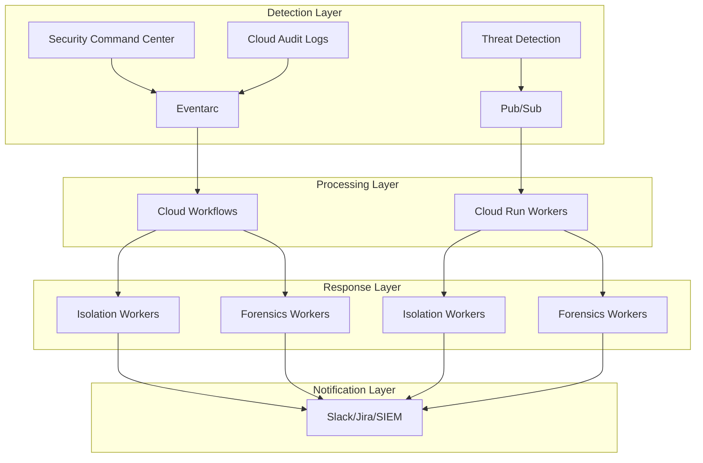
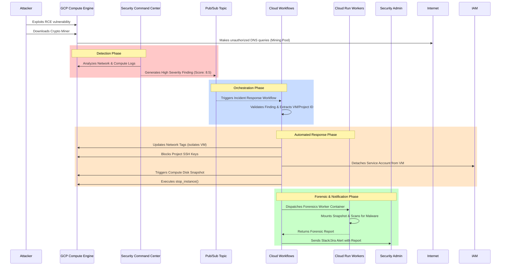

# 🚀 GCP Serverless Security Orchestration, Automation, and Response (SOAR)

 
 


Automated security incident response platform that detects threats using Security Command Center and automatically isolates compromised resources while preserving forensic evidence.

**[🇬🇧 English Architecture Guide](./ARCHITECTURE.md) | [🇻🇳 Bản giải thích tiếng Việt](./ARCHITECTURE_vi.md)**

## 🏗️ Architecture Overview

### System Architecture
```
Threat Detection → Event Router → Message Queue → Workflow Engine → Workers
     ↓                    ↓              ↓              ↓           ↓
GuardDuty/SCC → EventBridge/Eventarc → SQS/PubSub → Step Functions/Cloud Workflows → Container Workers
```

### GCP Architecture Flow


### Workflow Process
1. **Detection:** SCC detects threats (severity >= 7.0)
2. **Event Routing:** Eventarc routes to Pub/Sub queue
3. **Workflow Engine:** Cloud Workflows orchestrates response
4. **Container Workers:** Cloud Run performs long-running operations
5. **Human Approval:** Manual approval for critical actions
6. **Integrations:** Slack, Jira, SIEM notifications

### 🖼️ High-Level Architecture


## 🕵️ Threat Scenario

**Scenario:** An attacker discovers a Remote Code Execution (RCE) vulnerability on your public-facing application and installs a Monero cryptocurrency miner.

**Detection:** The malware begins making outbound DNS requests to known mining pools. GCP Security Command Center analyzes the logs and flags the instance with a *High-Severity* finding.

### ⚙️ Logical Data Flow


**Response Flow:**
1. Within seconds, the SOAR workflow executes.
2. The instance is isolated by replacing network tags with an `isolated-vm` tag, blocking all ingress and egress.
3. The IAM Service Account is detached from the VM.
4. SSH keys are blocked at the project level (`block-project-ssh-keys=TRUE`).
5. A snapshot of the VM's primary disk is taken for the Blue Team.
6. The VM is stopped to halt local execution.

### Timeline/Response Flow

```mermaid
gantt
    title GCP SOAR Incident Response Timeline
    dateFormat  s
    axisFormat  %S
    
    section Detection
    SCC Analyzes Logs           :a1, 0, 10s
    Eventarc Routes Finding     :a2, after a1, 2s
    
    section Automated Response
    Pub/Sub Buffers Message     :a3, after a2, 1s
    Workflow Validates Event    :a4, after a3, 2s
    GCE Network Isolation       :crit, a5, after a4, 3s
    SA Role Detachment          :crit, a6, after a5, 2s
    Block SSH Keys              :a7, after a6, 2s
    
    section Forensics
    Compute Disk Snapshotting   :a8, after a7, 15s
    GCE Instance Shutdown       :a9, after a8, 5s
    Cloud Run Malware Scan      :a10, after a9, 45s
    
    section Notification
    Compile Final Report        :a11, after a10, 2s
    Dispatch Slack/Jira Alert   :a12, after a11, 1s
```


## 🛡️ Advanced Features

### Workflow Engine (Cloud Workflows)
- **Human approval** workflows for critical actions
- **Multi-step incident response** with retry logic
- **Parallel execution** for isolation and forensics
- **Error handling** and dead letter queue processing

### Message Queue Layer (Pub/Sub)
- **Buffer layer** prevents system overload during attacks
- **Dead Letter Topics** handles failed processing
- **Batch processing** for improved performance
- **Cross-project message routing**

### Container Workers (Cloud Run)
- **Long-running operations** (15+ minute forensic scans)
- **Full environment** access for comprehensive analysis
- **Scalable compute** with auto-scaling
- **Health monitoring** and graceful degradation

### Multi-Project Security
- **Centralized security project** with cross-project roles
- **SCC organization** configuration
- **Cross-project incident response** capabilities
- **Secure identity federation** with external IDs

### Integrations
- **Slack/Teams** for real-time notifications
- **Jira/ServiceNow** for ticket management
- **SIEM integration** (Chronicle, Splunk, Elastic)
- **Threat intelligence** feeds (VirusTotal, AbuseIPDB)
- **Automated Scoring Engine** for decision-based orchestration

### Multi-Cloud Orchestration
- **Unified Event Normalizer** converts SCC/AuditLog events into a standard `UnifiedIncident` schema
- **Incident Correlator** groups related alerts by shared IOCs (IP, actor, ±5 min time window)
- **Campaign Detection** via BFS clustering for multi-stage attack identification

### AI/ML Anomaly Detection
- **Isolation Forest** model for behavioral anomaly detection
- **Z-Score Fallback** when ML model is not yet trained
- **Feature Vector**: `hour_of_day`, `day_of_week`, `ip_reputation_score`, `action_risk_level`, `request_frequency`
- **Enhanced Scoring**: anomaly boost (+15) automatically raises risk level

## 🗂️ Project Structure
- `src/`: Python code for the Cloud Functions and Cloud Run responders.
  - `main.py`: Main GCE incident response playbook
  - `storage_exfil_response.py`: Storage data exfiltration detection and response
  - `sa_compromise_response.py`: Service Account compromise detection and response
  - `core/event_normalizer.py`: Unified event normalization (→ `UnifiedIncident`)
  - `core/correlator.py`: Cross-cloud incident correlation engine
  - `integrations/anomaly_detector.py`: ML anomaly detection (Isolation Forest)
  - `integrations/scoring.py`: Risk scoring engine with anomaly boost
  - `integrations/intel.py`: Multi-source threat intelligence (VirusTotal, AbuseIPDB)
- `terraform/`: Infrastructure as Code (IaC) definitions to deploy all GCP resources.
- `attack_simulation/`: Interactive Attack Simulator Container (Docker wrapper for scripts targeting GCE, Storage, and SA).

## 🥊 Attack Simulator (New!)

To test the SOAR capabilities, a powerful built-in Red Team Docker container is provided.
You do not need to export credentials manually; the container maps your local gcloud credentials automatically.

```bash
# From the root of this project:
docker compose run --rm attacker
```

This will launch an interactive menu allowing you to:
1. Trigger the GCE Crypto Miner
2. Trigger Cloud Storage Data Exfiltration
3. Trigger Service Account Compromise
- `containers/`: Cloud Run forensic worker configuration.

## 🚀 Deployment

### Prerequisites
- [Terraform](https://www.terraform.io/downloads.html) installed locally.
- Google Cloud SDK (`gcloud`) installed and configured.
- A GCP Project with billing enabled.

### Environment Structure
```
terraform/
├── modules/                    # Reusable modules
│   ├── workflows/             # Cloud Workflows
│   ├── queues/                # Pub/Sub and Eventarc
│   ├── containers/            # Cloud Run workers
│   └── security/              # Multi-project security
├── environments/               # Environment-specific configs
│   ├── dev/                   # Development environment
│   ├── staging/               # Staging environment
│   └── prod/                  # Production environment
└── existing/                  # Original basic setup
```

### Quick Deploy
```bash
# Deploy SOAR platform
cd gcp-serverless-soar
./scripts/deploy.sh prod

# Configure integrations
gcloud secrets create slack-webhook-url --replication-policy automatic
echo "YOUR_WEBHOOK_URL" | gcloud secrets versions add slack-webhook-url --data-file=-
```

## 📊 Security Coverage

| Threat Type | Detection | Response Time | Risk Decision | Advanced Features |
|-------------|-----------|---------------|---------------|-------------------|
| GCE Compromise | SCC | < 30s | Scoring Engine | Workflow approval, container forensics |
| Storage Exfiltration | Audit Logs | < 60s | Scoring Engine | Multi-Intel enrichment, SIEM integration |
| SA Compromise | Audit Logs | < 45s | Scoring Engine | Decision-based orchestration, ticketing |
| DDoS Attacks | VPC Flow Logs | < 15s | Aggregated | Queue buffering, auto-scaling |

## 🔧 Configuration

### Local Development Environment
A `.env.example` file is provided in the repository root documenting all OS environment variables used by the playbooks.
- For local testing, copy this file to `.env` and adjust the values.
- In production, these parameters are securely injected into the Cloud Functions runtime by Terraform.

### Variables
- `worker_desired_count`: Container worker instances (prod: 3, dev: 1)
- `approval_wait_time`: Human approval timeout (prod: 3600s, dev: 300s)
- `enable_multi_project`: Cross-project security (default: true)
- `enable_integrations`: Slack/Jira/SIEM (default: true)

### Integration Setup
```bash
# Slack integration
gcloud secrets create slack-webhook-url --replication-policy automatic
echo "WEBHOOK_URL" | gcloud secrets versions add slack-webhook-url --data-file=-

# Jira integration
gcloud secrets create jira-url --replication-policy automatic
echo "https://your-domain.atlassian.net" | gcloud secrets versions add jira-url --data-file=-

gcloud secrets create jira-username --replication-policy automatic
echo "email@example.com" | gcloud secrets versions add jira-username --data-file=-

gcloud secrets create jira-api-token --replication-policy automatic
echo "API_TOKEN" | gcloud secrets versions add jira-api-token --data-file=-

gcloud secrets create jira-project-key --replication-policy automatic
echo "SEC" | gcloud secrets versions add jira-project-key --data-file=-

# SIEM integration
gcloud secrets create siem-api-key --replication-policy automatic
echo "API_KEY" | gcloud secrets versions add siem-api-key --data-file=-
```

## 📄 License

This project is licensed under the **Apache License 2.0**. See the [LICENSE](LICENSE) file for details.
