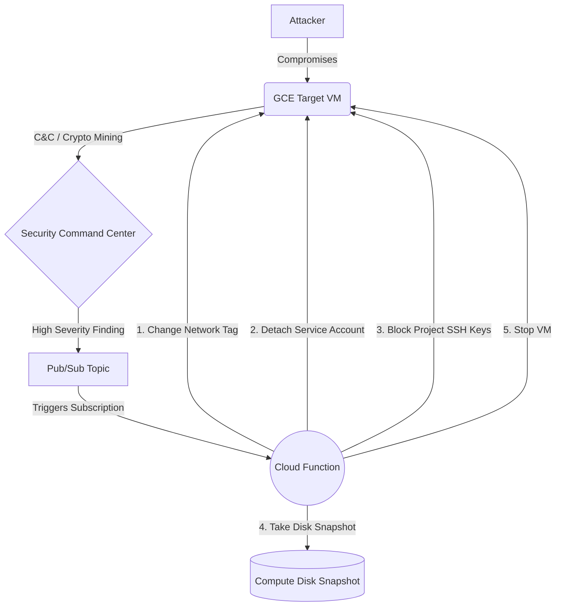

# GCP Serverless Security Orchestration, Automation, and Response (SOAR)

This project demonstrates a fully automated Serverless Incident Response architecture on Google Cloud Platform (GCP). It detects malicious activity using **Security Command Center (SCC)** and automatically isolates the compromised Compute Engine VM while preserving its state for forensic investigation.

## 🏛️ Architecture



The workflow involves:
1. **Detection:** GCP Security Command Center detects anomalous behavior (e.g., Cryptocurrency mining).
2. **Event Routing:** SCC pushes the finding event to a Pub/Sub topic.
3. **Automation Logic:** A Python Cloud Function is triggered by the Pub/Sub message.
4. **Resolution (Response Playbook):** 
   - **Isolate:** Replaces the VM's network tags with an `isolated-vm` tag. A pre-configured VPC Firewall rule explicitly denies all ingress and egress to this tag.
   - **Revoke Service Account:** Detaches the IAM Service Account from the VM.
   - **Block SSH:** Sets the instance metadata `block-project-ssh-keys=TRUE` to prevent adversaries from persisting via GCP-wide SSH keys.
   - **Preserve:** Takes a Snapshot of the VM's primary disk with forensic metadata tags attached.
   - **Stop:** Stops the VM to halt local execution.

## 🕵️ Threat Scenario

**Scenario:** An attacker exploits an RCE vulnerability on the VM and starts a crypto miner script.

**Detection:** The VM makes outbound HTTP requests to a mining pool. Next Generation Firewall / SCC Threat Detection flags the traffic as `Cryptocurrency mining` (High Severity).

**Response:** Within seconds, the SOAR workflow executes. The VM's network connections are severed via tag replacement, its IAM permissions are revoked, the drive is snapshotted for the Blue Team, and the VM is powered down.

## 🗂️ Project Structure
- `src/`: Python code for the Cloud Function responder.
- `terraform/`: Infrastructure as Code (IaC) definitions to deploy all GCP resources.
- `attack_simulation/`: Bash scripts to emulate malicious behavior and trigger the SOAR logic.

## 🚀 Deployment Instructions

### Prerequisites
- [Terraform](https://www.terraform.io/downloads.html) installed locally.
- GCP Cloud SDK (`gcloud`) installed and authenticated (`gcloud auth application-default login`).
- A GCP Project with Billing Enabled.
- Required APIs enabled: `compute.googleapis.com`, `cloudfunctions.googleapis.com`, `pubsub.googleapis.com`, `storage.googleapis.com`, `eventarc.googleapis.com`, `cloudbuild.googleapis.com`.

### Setup
1. Clone the repository and navigate to the terraform directory:
   ```bash
   cd terraform
   ```
2. Initialize and Apply Terraform:
   ```bash
   terraform init
   
   # During apply, provide your GCP Project ID
   terraform apply
   ```

## ⚔️ Simulation Guide: Triggering SOAR

**Method 1: Direct Pub/Sub Trigger (Instant & Easy)**
Instead of waiting for Security Command Center to natively pick up a threat, you can directly inject a mock finding into the Pub/Sub topic.
```bash
chmod +x attack_simulation/trigger_scc.sh

# Pass your Project ID, Zone, and the Target VM name
./attack_simulation/trigger_scc.sh my-gcp-project us-central1-a gce-target-01
```
Watch the Cloud Function logs in the GCP Console to see the playbook execute instantly!

**Method 2: Real simulation on the Target VM (Advanced)**
1. SSH into the `target_vm_public_ip` (provided in Terraform outputs).
2. Upload and run the miner script:
   ```bash
   chmod +x attack_simulation/gcp_miner.sh
   ./attack_simulation/gcp_miner.sh
   ```
3. Assuming your GCP Project has **Premium tier Security Command Center** enabled, wait 15-30 minutes for SCC to identify the DNS requests and push the finding.
4. The VM will suddenly drop SSH connection, its Service Account will vanish, and it will shut down. Check the Disks dashboard for the forensic snapshot!
