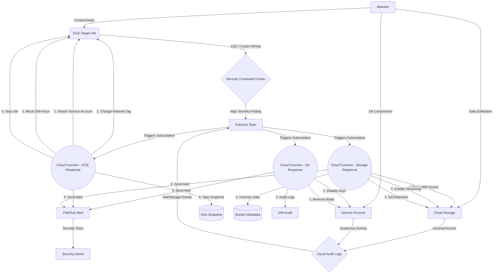

# 🚀 GCP Serverless Security Orchestration, Automation, and Response (SOAR)

 
 


This project demonstrates a fully automated, enterprise-grade Serverless Incident Response architecture on Google Cloud Platform (GCP). It detects malicious activity using **Security Command Center (SCC)** and automatically isolates compromised resources while preserving state for forensic investigation.

## 🏛️ Architecture

### 🖼️ High-Level Architecture


### ⚙️ Logical Data Flow (Mermaid)


The workflow involves:
1. **Detection:** GCP Security Command Center detects anomalous behavior (e.g., Cryptocurrency mining).
2. **Event Routing:** SCC pushes the finding event to a Pub/Sub topic.
3. **Automation Logic:** A Python Cloud Function is triggered by the Pub/Sub message.
4. **Resolution (Response Playbook):** 
   - **Isolate:** Replaces the VM's network tags with an `isolated-vm` tag. A pre-configured VPC Firewall rule explicitly denies all ingress and egress to this tag.
   - **Revoke Service Account:** Detaches the IAM Service Account from the VM.
   - **Block SSH:** Sets the instance metadata `block-project-ssh-keys=TRUE` to prevent adversaries from persisting via GCP-wide SSH keys.
   - **Preserve:** Takes a Snapshot of the VM's primary disk with forensic metadata tags attached.
   - **Stop:** Stops the VM to halt local execution.

## 🕵️ Threat Scenario

**Scenario:** An attacker exploits an RCE vulnerability on the VM and starts a crypto miner script.

**Detection:** The VM makes outbound HTTP requests to a mining pool. Next Generation Firewall / SCC Threat Detection flags the traffic as `Cryptocurrency mining` (High Severity).

**Response:** Within seconds, the SOAR workflow executes. The VM's network connections are severed via tag replacement, its IAM permissions are revoked, the drive is snapshotted for the Blue Team, and the VM is powered down.

## 🗂️ Project Structure
- `src/`: Python code for the Cloud Function responders.
  - `main.py`: Main GCE VM incident response playbook
  - `storage_exfil_response.py`: Cloud Storage data exfiltration detection and response
  - `sa_compromise_response.py`: Service account compromise detection and response
- `terraform/`: Infrastructure as Code (IaC) definitions to deploy all GCP resources.
- `attack_simulation/`: Bash scripts to emulate malicious behavior and trigger the SOAR logic.

## 🚀 Deployment Instructions

### Prerequisites
- [Terraform](https://www.terraform.io/downloads.html) installed locally.
- GCP Cloud SDK (`gcloud`) installed and authenticated (`gcloud auth application-default login`).
- A GCP Project with Billing Enabled.
- Required APIs enabled: `compute.googleapis.com`, `cloudfunctions.googleapis.com`, `pubsub.googleapis.com`, `storage.googleapis.com`, `eventarc.googleapis.com`, `cloudbuild.googleapis.com`.

### Setup
1. Clone the repository and navigate to the terraform directory:
   ```bash
   cd terraform
   ```
2. Initialize and Apply Terraform:
   ```bash
   terraform init
   
   # During apply, provide your GCP Project ID
   terraform apply
   ```

## ⚔️ Simulation Guide: Triggering SOAR

**Method 1: Direct Pub/Sub Trigger (Instant & Easy)**
Instead of waiting for Security Command Center to natively pick up a threat, you can directly inject a mock finding into the Pub/Sub topic.
```bash
chmod +x attack_simulation/trigger_scc.sh

# Pass your Project ID, Zone, and the Target VM name
./attack_simulation/trigger_scc.sh my-gcp-project us-central1-a gce-target-01
```
Watch the Cloud Function logs in the GCP Console to see the playbook execute instantly!

**Method 2: Real simulation on the Target VM (Advanced)**
1. SSH into the `target_vm_public_ip` (provided in Terraform outputs).
2. Upload and run the miner script:
   ```bash
   chmod +x attack_simulation/gcp_miner.sh
   ./attack_simulation/gcp_miner.sh
   ```
3. Assuming your GCP Project has **Premium tier Security Command Center** enabled, wait 15-30 minutes for SCC to identify the DNS requests and push the finding.
4. The VM will suddenly drop SSH connection, its Service Account will vanish, and it will shut down. Check the Disks dashboard for the forensic snapshot!

## 🛡️ Additional Security Playbooks

### 1. Cloud Storage Data Exfiltration Detection & Response
**Detection:** Monitors Cloud Audit Logs for unusual Cloud Storage access patterns:
- Large volume downloads (>10GB threshold)
- High frequency access (>1000 operations/24hrs)
- Multiple source IPs accessing the same bucket
- Off-hours access patterns
- Rapid succession downloads

**Response Actions:**
- Block user access via IAM policies
- Enable bucket protection features (versioning, retention policies)
- Create forensic snapshots of bucket metadata
- Send security alerts via Pub/Sub

**Trigger:** Cloud Audit Logs for `storage.objects.get` operations

### 2. Service Account Compromise Detection & Response
**Detection:** Analyzes IAM audit events for suspicious service account activities:
- Unauthorized service account key creation
- Unusual source IPs accessing service accounts
- Privilege escalation attempts
- Suspicious timing patterns

**Response Actions:**
- Disable all service account keys
- Remove from critical IAM roles
- Create forensic audit logs
- Send security alerts with detailed analysis

**Trigger:** Cloud Audit Logs for `iam.serviceAccounts.*` operations

## 🎯 Deployment for New Playbooks

To deploy the additional security playbooks:

1. **Storage Exfiltration Response:**
   ```bash
   # Deploy Cloud Function
   gcloud functions deploy storage-exfil-response \
     --runtime python39 \
     --trigger-topic cloud-audit-logs \
     --entry-point storage_exfil_responder \
     --source src/ \
     --set-env-vars PROJECT_ID=$PROJECT_ID,ALERT_TOPIC=security-alerts,EXFILTRATION_THRESHOLD=10737418240
   
   # Enable Cloud Audit Logging for Storage
   gcloud logging sinks create storage-audit-sink \
     pubsub.googleapis.com/projects/$PROJECT_ID/topics/security-alerts \
     --log-filter='resource.type="gcs_bucket" AND protoPayload.methodName="storage.objects.get"'
   ```

2. **Service Account Compromise Response:**
   ```bash
   # Deploy Cloud Function
   gcloud functions deploy sa-compromise-response \
     --runtime python39 \
     --trigger-topic iam-audit-logs \
     --entry-point sa_compromise_responder \
     --source src/ \
     --set-env-vars PROJECT_ID=$PROJECT_ID,ALERT_TOPIC=security-alerts
   
   # Enable Cloud Audit Logging for IAM
   gcloud logging sinks create iam-audit-sink \
     pubsub.googleapis.com/projects/$PROJECT_ID/topics/security-alerts \
     --log-filter='resource.type="iam_service_account" AND protoPayload.methodName="iam.serviceAccounts.*"'
   ```

## 📊 Security Coverage Matrix

| Threat Type | Detection Source | Response Time | Automated Actions |
|-------------|------------------|---------------|-------------------|
| GCE Crypto Mining | Security Command Center | < 30 seconds | Isolate, Snapshot, Stop |
| Storage Exfiltration | Cloud Audit Logs | < 60 seconds | Block Access, Protect Bucket |
| SA Compromise | Cloud Audit Logs | < 45 seconds | Disable Keys, Remove Roles |
| GCE C&C Activity | SCC Threat Detection | < 30 seconds | Isolate, Revoke Sessions |

## ⚡ Scaling & Reliability
- Cloud Functions Gen2 scale automatically by event volume; tune instance count, memory, and timeout via Terraform.
- Increase max instances for bursty SCC findings; raise memory/timeout for heavy snapshots and audit log queries.
- Use min instances to keep responders warm for faster reaction time.

## �🔧 Configuration Options

### Environment Variables
- `EXFILTRATION_THRESHOLD`: Storage download size threshold (default: 10GB)
- `ALERT_TOPIC`: Pub/Sub topic for security alerts
- `PROJECT_ID`: GCP Project ID
- `RISK_SCORE_THRESHOLD`: Minimum risk score for automated response (default: 6)

### Terraform Variables
- `function_max_instances`: Max instances per Cloud Function
- `function_min_instances`: Min instances kept warm
- `function_memory`: Memory size for Cloud Functions
- `function_timeout_seconds`: Timeout in seconds for Cloud Functions
