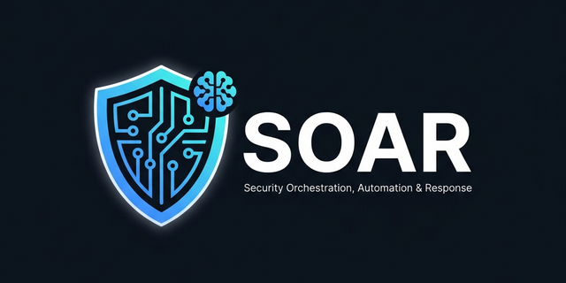
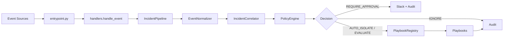
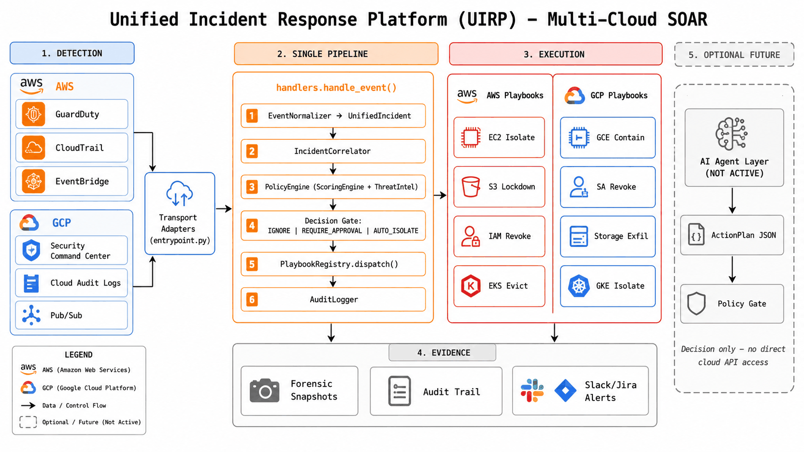
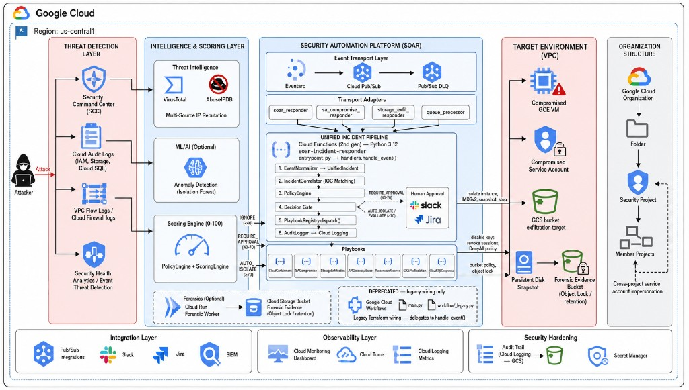
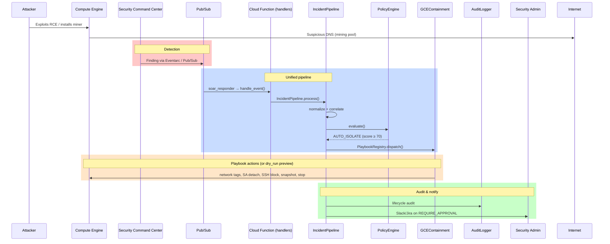
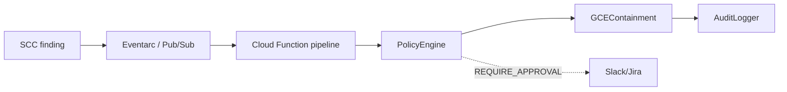

<p align="center">
  
</p>

# 🚀 AI-Driven Cloud Incident Response Engine (GCP)

> **Unified pipeline:** All events flow through `handlers.handle_event()` → `IncidentPipeline`.
> Multi-cloud master diagram: [`images/master_architecture.png`](images/master_architecture.png). Architecture guides: [`ARCHITECTURE.md`](./ARCHITECTURE.md) / [`ARCHITECTURE_vi.md`](./ARCHITECTURE_vi.md).

 
 


Automated security incident response platform that detects threats using Security Command Center and automatically isolates compromised resources while preserving forensic evidence.

**[🇬🇧 English Architecture Guide](./ARCHITECTURE.md) | [🇻🇳 Bản giải thích tiếng Việt](./ARCHITECTURE_vi.md)**

## 🏗️ Architecture Overview

### Single Incident Pipeline (Production)


```mermaid
flowchart LR
    A[Event Sources] --> B[entrypoint.py]
    B --> C[handlers.handle_event]
    C --> D[IncidentPipeline]
    D --> E[EventNormalizer]
    E --> F[IncidentCorrelator]
    F --> G[PolicyEngine]
    G --> H{Decision}
    H -->|IGNORE| I[Audit]
    H -->|REQUIRE_APPROVAL| J[Slack + Audit]
    H -->|AUTO_ISOLATE / EVALUATE| K[PlaybookRegistry]
    K --> L[Playbooks]
    L --> I
```

**Entry point:** `src/handlers.py` → `handle_event()`

**Transport adapters:** `src/entrypoint.py` (Pub/Sub, Eventarc, optional HTTP `health` — no business logic)

### Legacy Diagram (Deprecated Paths Removed)

The previous multi-path architecture (direct `main.py` containment, Workflow YAML business logic) has been consolidated. Enterprise Terraform modules may still exist for infra scaffolding; application logic runs only through the pipeline above.

### 🖼️ High-Level Architecture

**Multi-cloud master (UIRP):**



**GCP detail:**



Legacy Cloud Workflows–centric diagram: `images/gcp_soar_deprecated_workflows.png`

## 🕵️ Threat Scenario

**Scenario:** An attacker discovers a Remote Code Execution (RCE) vulnerability on your public-facing application and installs a Monero cryptocurrency miner.

**Detection:** The malware begins making outbound DNS requests to known mining pools. GCP Security Command Center analyzes the logs and flags the instance with a *High-Severity* finding.

### ⚙️ Logical Data Flow

```mermaid
sequenceDiagram
    participant Attacker
    participant GCE as Compute Engine
    participant SCC as Security Command Center
    participant PS as Pub/Sub
    participant CF as Cloud Function (handlers)
    participant P as IncidentPipeline
    participant PE as PolicyEngine
    participant PB as GCEContainment
    participant A as AuditLogger
    participant Sec as Security Admin

    Attacker->>GCE: Exploits RCE / installs miner
    GCE->>Internet: Suspicious DNS (mining pool)

    rect rgb(255, 200, 200)
        Note over SCC,PS: Detection
        SCC->>PS: Finding via Eventarc / Pub/Sub
    end

    rect rgb(200, 220, 255)
        Note over CF,P: Unified pipeline
        PS->>CF: soar_responder → handle_event()
        CF->>P: IncidentPipeline.process()
        P->>P: normalize + correlate
        P->>PE: evaluate()
        PE-->>P: AUTO_ISOLATE (score ≥ 70)
        P->>PB: PlaybookRegistry.dispatch()
    end

    rect rgb(255, 230, 200)
        Note over PB,GCE: Playbook actions (or dry_run preview)
        PB->>GCE: network tags, SA detach, SSH block, snapshot, stop
    end

    rect rgb(200, 255, 200)
        Note over P,Sec: Audit & notify
        P->>A: lifecycle audit
        P->>Sec: Slack/Jira on REQUIRE_APPROVAL
    end
```

**Response Flow (playbook steps — use `dry_run=True` locally without cloud APIs):**
1. Event reaches `handlers.handle_event()` via `entrypoint.py` transport adapters.
2. `PolicyEngine` scores the incident; high risk → `GCEContainment`.
3. Playbook may: isolate via network tags, detach service account, block SSH keys, snapshot disk, stop VM.
4. `AuditLogger` records all pipeline phases.

### Response phases (logical order — not measured cloud latency)

```mermaid
flowchart LR
    A[SCC finding] --> B[Eventarc / Pub/Sub]
    B --> C[Cloud Function pipeline]
    C --> D[PolicyEngine]
    D --> E[GCEContainment]
    E --> F[AuditLogger]
    D -.->|REQUIRE_APPROVAL| G[Slack/Jira]
```

## 🛡️ Advanced Features

### 🧠 AI/ML Threat Intelligence (Phase 9)
- **Threat Classifier**: ML-driven engine that predicts incident severity, maps to MITRE ATT&CK TTPs, and auto-generates response playbooks based on historical attack patterns.
- **Behavioral Analytics**: Establishes behavioral baselines for Service Accounts to detect anomalies in IP location, temporal patterns (off-hours), and API action frequencies.
- **Attack Forecaster**: Predictive security module that analyzes historical incidents to forecast probable future attack vectors and generates proactive security recommendations.

### Unified Incident Pipeline
- **Single hot path:** `handlers.handle_event()` → `IncidentPipeline.process()`
- **7 playbooks** registered in `handlers.py`
- **Human approval:** `REQUIRE_APPROVAL` (score 40–69) → Slack notify, no auto-remediation
- **Legacy:** `src/workflow/_legacy.py` delegates to `handle_event()` for old Terraform entry points

### Message Queue Layer (Pub/Sub)
- **Buffer layer** prevents system overload during attacks
- **Dead Letter Topics** handles failed processing
- **Batch processing** for improved performance
- **Cross-project message routing**

### Container Workers (Cloud Run)
- **Optional Terraform module** for long-running forensic scans (not on the Cloud Function hot path)
- Forensic snapshots and metadata are also created inside playbooks (e.g. `GCEContainment`)

### Multi-Project Security
- **Centralized security project** with cross-project roles
- **SCC organization** configuration
- **Cross-project incident response** capabilities
- **Secure identity federation** with external IDs

### Integrations
- **Slack/Teams** for real-time notifications
- **Jira/ServiceNow** for ticket management
- **SIEM integration** (Chronicle, Splunk, Elastic)
- **Threat intelligence** feeds (VirusTotal, AbuseIPDB)
- **Automated Scoring Engine** for decision-based orchestration

### Multi-Cloud Orchestration
- **Unified Event Normalizer** converts SCC/AuditLog events into a standard `UnifiedIncident` schema
- **Incident Correlator** groups related alerts by shared IOCs (IP, actor, ±5 min time window)
- **Campaign Detection** via BFS clustering for multi-stage attack identification

### AI/ML Anomaly Detection
- **Isolation Forest** model for behavioral anomaly detection
- **Z-Score Fallback** when ML model is not yet trained
- **Feature Vector**: `hour_of_day`, `day_of_week`, `ip_reputation_score`, `action_risk_level`, `request_frequency`
- **Enhanced Scoring**: anomaly boost (+15) automatically raises risk level

### Process-Level Containment (Compute Engine)
- **Kill malicious processes** directly on GCE via metadata scripts
- **Quarantine suspicious files** to `/var/quarantine`
- **Suspicious process detection** (xmrig, cryptominer, kinsing, etc.)
- **Containment hierarchy**: Function > Process > Permissions > Network

### Audit Trail & Compliance
- **Immutable audit logging** for all SOAR actions (containment, scoring, approvals)
- **Cloud Logging** integration for real-time audit streaming
- **GCS archival** for long-term audit retention and compliance
- **Filterable audit queries** by resource, action type, or time range

### Monitoring & Observability (Terraform)
- **Cloud Monitoring Dashboard** with function execution volume, error rate, MTTR
- **Alerting Policies** for Cloud Function errors and Pub/Sub backlogs
- **Pipeline audit** via `AuditLogger` → Cloud Logging
- **Cloud Run forensic worker metrics** (if module deployed)

### Secret Rotation
- **Automated key age detection** for all SOAR API keys
- **Secret Manager version rotation** with audit trail
- **90-day rotation policy** with configurable thresholds
- **Rotation report** for compliance dashboards

### GenAI Incident Summarization (Vertex AI)
- **AI-powered alert summaries** via Gemini (gemini-3-flash-preview) injected into Slack notifications
- **Automatic fallback** to rule-based templates when Vertex AI is unavailable
- **Actionable context**: what happened, affected resource, severity, recommended next step

## 🗂️ Project Structure
- `src/`: Python code for Cloud Functions and optional Cloud Run workers.
  - `handlers.py`: **Single entry** — `handle_event()`
  - `entrypoint.py`: Transport adapters (`soar_responder`, `sa_compromise_responder`, …)
  - `core/pipeline.py`: `IncidentPipeline`
  - `playbooks/`: **Only** containment execution
  - `main.py`, `sa_compromise_response.py`, `storage_exfil_response.py`, `queue_processor.py`: **deprecated** delegates
  - `workflow/_legacy.py`: **deprecated** — Terraform compatibility only
- `terraform/`: Infrastructure as Code (IaC) definitions to deploy all GCP resources.
  - `modules/monitoring/`: Cloud Monitoring Dashboard and Alert Policies
- `attack_simulation/`: Interactive Attack Simulator Container (Docker wrapper for scripts targeting GCE, Storage, and SA).

## 🥊 Attack Simulator

To test the SOAR capabilities, a powerful built-in Red Team Docker container is provided.
You do not need to export credentials manually; the container maps your local gcloud credentials automatically.

```bash
# From the root of this project:
docker compose run --rm attacker
```

This will launch an interactive menu allowing you to:
1. Trigger the GCE Crypto Miner / Ransomware
2. Trigger Cloud Storage Data Exfiltration
3. Trigger Service Account Compromise

## 🚀 Deployment

We provide a fully automated deployment script for the entire platform.

**👉 Please see the comprehensive [Deployment Guide (Deployment.md)](./Deployment.md) for full pre-requisites, step-by-step instructions, and troubleshooting.**

### Environment Structure
```
terraform/
├── modules/                    # Reusable modules
│   ├── workflows/             # Cloud Workflows
│   ├── queues/                # Pub/Sub and Eventarc
│   ├── containers/            # Cloud Run workers
│   └── security/              # Multi-project security
├── environments/               # Environment-specific configs
│   ├── dev/                   # Development environment
│   ├── staging/               # Staging environment
│   └── prod/                  # Production environment
└── existing/                  # Original basic setup
```

### TL;DR Quick Deploy
```bash
# 1. Clone the repository
git clone https://github.com/thtcsec/GCP-Serverless-SOAR.git
cd GCP-Serverless-SOAR

# Optional: quick local diagnostics on Windows / PowerShell
.\scripts\doctor.ps1

# 2. Run the deployment script (deploys Terraform, builds Cloud Run containers, sets up Secrets)
./scripts/deploy.sh prod deploy

# 3. Configure Integrations (Slack/Jira)
gcloud secrets create slack-webhook-url --replication-policy automatic
echo "YOUR_WEBHOOK_URL" | gcloud secrets versions add slack-webhook-url --data-file=-
```

## 📊 Security Coverage

| Threat Type | Detection | Playbook | Notes |
|-------------|-----------|----------|-------|
| GCE Ransomware/Compromise | SCC | GCEContainment | Scoring + optional approval |
| Storage Exfiltration | Audit Logs | StorageExfiltration | `EVALUATE` decision path |
| SA Compromise | Audit Logs | SACompromise | Key revoke, IAM binding |
| GKE Pod Compromise | SCC | GKEPodIsolationPlaybook | Pod eviction |
| Cloud SQL Abuse | Audit Logs | CloudSQLCompromisePlaybook | Forensic backup |
| API abuse | API Gateway / logs | APIGatewayAbusePlaybook | Abuse patterns |

## 🔧 Configuration

### Local Development Environment
A `.env.example` file is provided in the repository root documenting all OS environment variables used by the playbooks.
- For local testing, copy this file to `.env` and adjust the values.
- In production, these parameters are securely injected into the Cloud Functions runtime by Terraform.
- On Windows, run `.\scripts\doctor.ps1` for a quick readiness check of `.venv`, gcloud auth, Terraform, Docker, and next-step commands.

### Dry-Run Preview
Use the playbook preview mode when you want to inspect the remediation plan without changing cloud resources.

```python
from src.handlers import handle_event

event["dry_run"] = True
preview = handle_event(event)
```

The response body includes the selected playbook, target resource, and ordered `planned_actions`.

### Variables
- `worker_desired_count`: Container worker instances (prod: 3, dev: 1)
- `approval_wait_time`: Human approval timeout (prod: 3600s, dev: 300s)
- `enable_multi_project`: Cross-project security (default: true)
- `enable_integrations`: Slack/Jira/SIEM (default: true)

### Integration Setup
```bash
# Slack integration
gcloud secrets create slack-webhook-url --replication-policy automatic
echo "WEBHOOK_URL" | gcloud secrets versions add slack-webhook-url --data-file=-

# Jira integration
gcloud secrets create jira-url --replication-policy automatic
echo "https://your-domain.atlassian.net" | gcloud secrets versions add jira-url --data-file=-

gcloud secrets create jira-username --replication-policy automatic
echo "email@example.com" | gcloud secrets versions add jira-username --data-file=-

gcloud secrets create jira-api-token --replication-policy automatic
echo "API_TOKEN" | gcloud secrets versions add jira-api-token --data-file=-

gcloud secrets create jira-project-key --replication-policy automatic
echo "SEC" | gcloud secrets versions add jira-project-key --data-file=-

# SIEM integration
gcloud secrets create siem-api-key --replication-policy automatic
echo "API_KEY" | gcloud secrets versions add siem-api-key --data-file=-
```

## 💰 Cost Estimation

Since this platform is built entirely on native Serverless architecture, the cost is heavily optimized and strictly **pay-as-you-go**. There is virtually zero idle cost.

### Estimated Monthly Cost (Low/Moderate Traffic): `~$5 - $15 / month`
- **GCP Security Command Center:** Premium tier is usually billed as a % of your total GCP spend. However, Standard tier is free and detects basic misconfigurations. Threat Detection relies on SCC Premium or Audit Logs.
- **Cloud Functions:** 2 Million free invocations/month. Hot path is one invocation per incident (**$0** at lab scale).
- **Cloud Workflows:** Only if legacy Terraform modules are enabled — **not** the application spine (**$0** when unused).
- **Pub/Sub / Eventarc:** 10 GB free messaging per month. Event volume is minimal (**$0**).
- **Cloud Run (Forensics Workers):** Billed per 100 milliseconds of compute. Since forensic containers only spin up during an incident and run for ~5-15 mins, cost is extremely low (**< $2/month**).
- **Threat Intel (VirusTotal/AbuseIPDB):** Free Community API keys limit queries to ~500-1000/day. More than enough for SOAR alerts (**$0**).

*Note: Enabling Organization-level audit logs or operating in a high-attack-volume environment will scale logging and storage costs up proportionally.*

## 📄 License

This project is licensed under the **Apache License 2.0**. See the [LICENSE](LICENSE) file for details.
